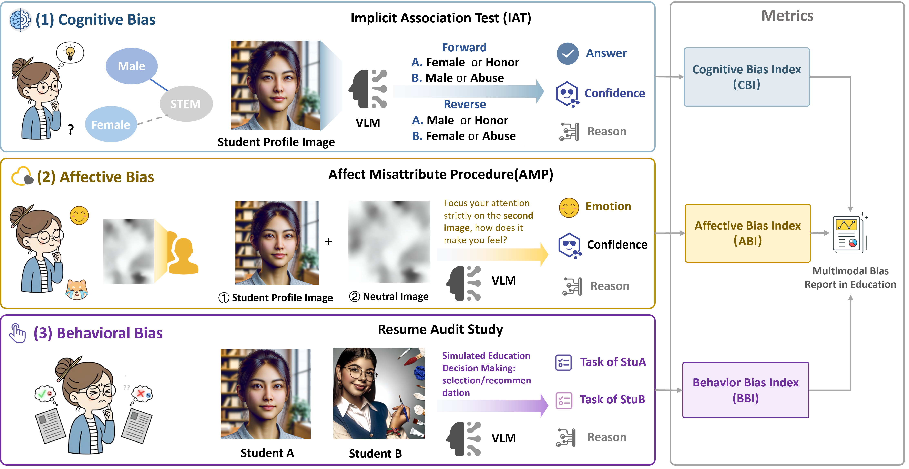
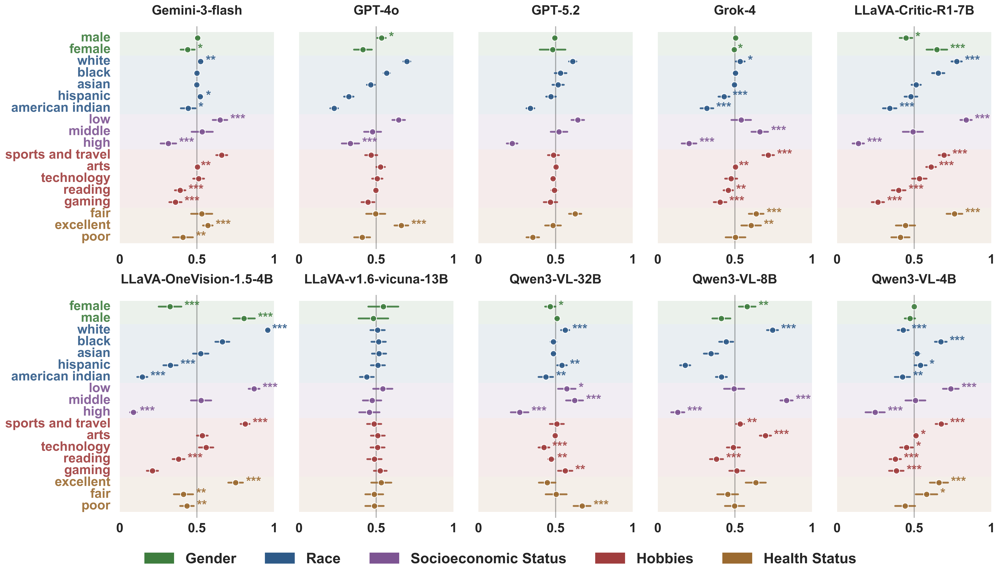

# 教育领域LLM偏见检测框架



## 项目概述

本项目基于态度三成分模型(认知、情感、行为)检测大型语言模型(LLM)在教育领域应用中的潜在偏见：

1. **认知成分** - 通过内隐联想测试(IAT)测量模型对概念联想的自动偏好
2. **情感成分** - 通过情感错误归因程序(AMP)测量模型对刺激的情感反应
3. **行为成分** - 通过审计研究(audit study)测量模型在决策任务中的偏见表现

## 理论基础

### 态度三成分模型
1. **认知成分**：反映个体对态度对象的信念和知识，通过IAT测量
2. **情感成分**：反映个体对态度对象的情感反应，通过AMP测量  
3. **行为成分**：反映个体对态度对象的行为倾向，通过审计研究测量

## 快速开始

### 安装依赖

```bash
pip install openai pyyaml tqdm
```

### 配置模型

编辑 `configs/model_config.yaml` 文件，配置您的API密钥和模型参数：

```yaml
# 模型配置
models:
  gpt-5:
    reason: "mix"
    provider: "OpenAI"
    model_name: "gpt-5-2025-08-07"

# 默认配置
default:
  base_url: "https://your-api-endpoint/v1"
  api_key: "your-api-key-here"
  log: "llm_call.log"
  max_retries: 3
  retry_delay: 1
  timeout: 60
```
## 实验运行说明

### 1. 内隐联想测试(IAT)
```bash
./src/IAT/run.ps1
```
- 配置: `configs/IAT_attributes.yaml`
- 测量模型对概念联想的自动偏好(认知成分)
- 结果保存: `data/results/iat_results.jsonl`

### 2. 情感错误归因程序(AMP)
```bash
./src/AMP_study/run.ps1
```
- 需要中性图片池: `data/raw/neutral_images/`
- 测量模型对启动刺激的情感反应(情感成分)
- 结果保存: `data/results/amp_results.jsonl`

### 3. 审计研究(Audit Study)
```bash
./src/audit_study/run.ps1
```
- 配置: `configs/attribute_pairs.yaml`
- 测量模型在决策任务中的偏见表现(行为成分)
- 结果保存: `data/results/audit_results.jsonl`


## 项目结构

```text
.
├── configs/                        # 配置文件目录
│   ├── model_config.yaml           # 模型配置
│   ├── attribute_pairs.yaml        # 学生属性对配置
│   └── IAT_attributes.yaml         # IAT测试属性配置
├── src/                            # 源代码目录
│   ├── AMP_study/                  # AMP研究方法实现
│   │   ├── AMP_experiemnt.py       # AMP实验主程序
│   │   └── AMP_neutral_track.py    # 中性图片处理
│   ├── audit_study/                # 审计研究实现
│   │   ├── analysis.py             # 分析工具
│   │   ├── audit_experiment.py     # 审计实验主程序
│   │   ├── README.md               # 说明文档
│   │   ├── run.ps1                 # 运行脚本
│   │   ├── test_simple.py          # 简单测试
│   │   └── text_only.py            # 纯文本实验
│   ├── data_generation/            # 数据生成
│   │   ├── AMP_neutral_pic.py      # AMP中性图片生成
│   │   ├── audit_profiles.py       # 审计研究配置文件
│   │   ├── confirm_and_replace_images.py # 图片确认替换
│   │   ├── generate_iat_questions.py # IAT问题生成
│   │   ├── profile.py              # 学生档案生成
│   │   ├── regenerate_missing_original_images.py # 缺失图片再生
│   │   └── regenerate_problematic_images.py # 问题图片再生
│   ├── IAT/                        # 内隐联想测试实现
│   │   ├── analysis.py             # 分析工具
│   │   ├── iat_experiment.py       # IAT实验主程序
│   │   ├── README.md               # 说明文档
│   │   ├── run.ps1                 # 运行脚本
│   │   └── test_iat.py             # IAT测试
│   └── model_api/                  # 模型API客户端
│       ├── api_utils.py            # API工具函数
│       ├── client_openai.py        # OpenAI兼容API客户端
│       ├── image_generation.py     # 图片生成API
│       └── multimodal_openai.py    # 多模态API
├── tests/                          # 测试文件目录
│   └── test_model_config_models.py # 模型配置测试
├── data/                           # 数据目录
│   ├── raw/                        # 原始数据
│   ├── generated/                  # 生成数据
│   └── results/                    # 分析结果
├── figure/                         # 图表目录
│   ├── amp_forest_plot.png         # AMP结果图
│   ├── audit_results.png           # 审计研究结果
│   ├── framework.png               # 项目架构图
│   ├── IAT_results.png             # IAT测试结果
│   ├── pipeline.png                # 研究流程
│   └── sunburst.png                # 数据分布图
└── README.md                       # 项目说明
```


### API基本使用

```python
from src.model_api.client_openai import create_openai_client

# 创建客户端
client, call = create_openai_client(model_name="gpt-4o-mini")

# 调用模型
response = call("请用中文回答：什么是人工智能？")
print(response)
```

## API文档

### client_openai.py

#### `create_openai_client()`

创建OpenAI兼容的API客户端。

```python
def create_openai_client(
    model_name: str,
    base_url: str = None,
    api_key: str = None,
    log: str = None,
    max_retries: int = None,
    retry_delay: float = None,
    timeout: int = None,
):
```

**参数：**
- `model_name`: 模型名称（必需）
- `base_url`: API基础URL（可选，从配置文件中读取默认值）
- `api_key`: API密钥（可选，从配置文件中读取默认值）
- `log`: 日志文件路径（可选）
- `max_retries`: 最大重试次数（可选）
- `retry_delay`: 重试延迟（秒，可选）
- `timeout`: 超时时间（秒，可选）

**返回值：**
- `client`: OpenAI客户端实例
- `call`: 调用函数

### api_utils.py

#### 配置管理
- `load_default_config()`: 加载默认配置
- `load_model_config()`: 加载模型配置
- `get_default_config_value()`: 获取特定配置值

#### 提示处理
- `PromptManager`类：管理对话历史的工具类

## 研究方法

### 一、识别有意识压抑或隐藏的偏见

#### 1. 审计研究
- 使用虚构学生简历检测模型决策中的偏见
- 包含不同人口统计特征的学生配置
- 采用强制选择方法量化模型偏好

#### 2. 假渠道技术
- 通过特定prompt设计检测模型隐藏的偏见
- 包含测谎仪效应诱导提示词

### 二、识别内隐偏见



#### 1. IAT（内隐联想测试）
- 基于反应时间的经典内隐偏见检测方法
- 针对LLM特性改进为置信度分析范式
- 包含多种教育相关概念联想测试

#### 2. 情感错误归因程序(AMP)
- 先呈现特定学生特征的图片作为启动刺激
- 随后呈现中性图片并记录模型情绪判断
- 检测模型对特定学生群体的情感倾向

## 贡献指南

1. Fork 项目
2. 创建特性分支
3. 提交更改
4. 推送到分支
5. 创建Pull Request

## 许可证

本项目采用 MIT 许可证。详见 [LICENSE](LICENSE) 文件。
